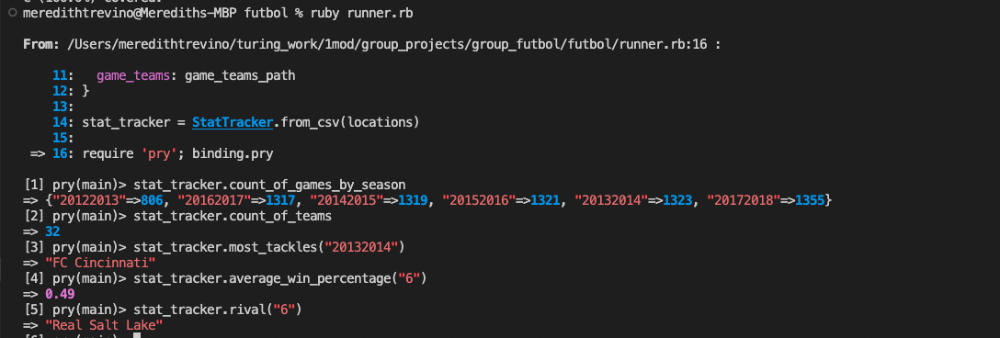
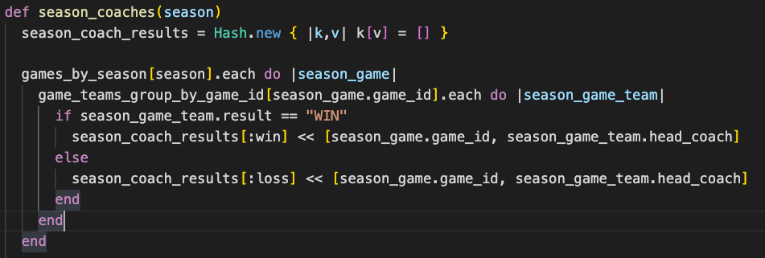
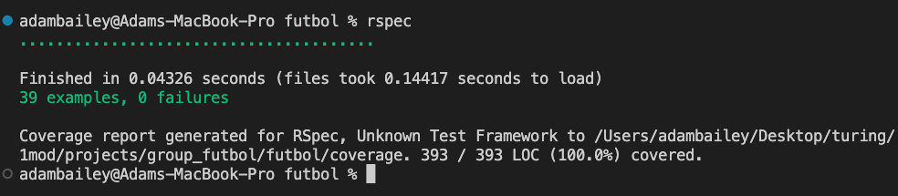
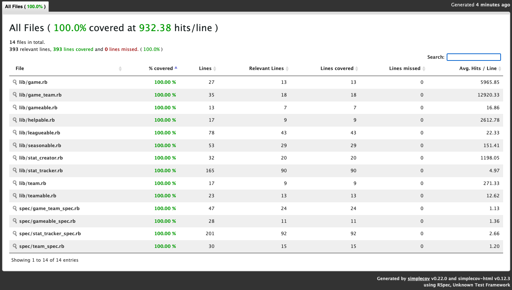
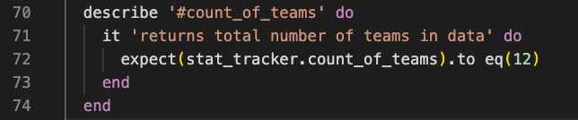
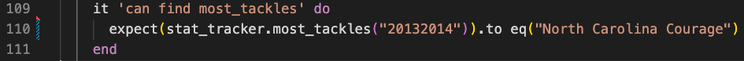
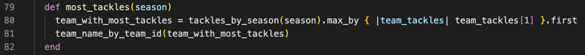
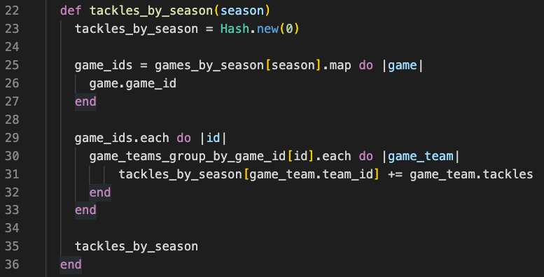
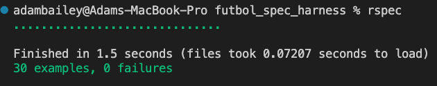

## ╔═══╗──╔╗╔╗────╔╗
## ║╔══╝─╔╝╚╣║────║║
## ║╚══╦╗╠╗╔╣╚═╦══╣║
## ║╔══╣║║║║║╔╗║╔╗║║
## ║║──║╚╝║╚╣╚╝║╚╝║╚╗
## ╚╝──╚══╩═╩══╩══╩═╝

---
## Futbol Project Description
Futbol is a statistical program that pulls data from three separate datasets with respect to the game of futbol. The user is able to call on unique methods to run specific analysis on the data. The methods are listed below under the content section 'Methods'.

---

## Contents
1. Installation
2. Methods
3. Demonstration of functional completeness
4. Technical quality and organization of the code
5. Identifying areas of code that you decided to refactor
6. Discussion of collaboration/version control
7. Discussion of test coverage
8. Future goals
9. Group Discussion
10. Individual Questions

---

## Installation
Please clone the below repository to your local machine, navigate to the root directory `./futbol` and run `ruby runner.rb` in your terminal.

https://github.com/HuyPhan2025/futbol

## Methods
<u>Game Methods</u>
- highest_total_score
- lowest_total_score
- percentage_home_wins
- percentage_visitor_wins
- percentage_ties
- count_of_games_by_season
- average_goals_per_game
- average_goals_per_season

<u>League Methods</u>
- count_of_teams
- best_offense
- worst_offense
- highest_scoring_visitor
- highest_scoring_home_team
- lowest_scoring_visitor
- lowest_scoring_home_team

<u>Season Methods</u>
- winningest_coach(season*)
- worst_coach(season*)
- most_accurate_team(season*)
- least_accurate_team(season*)
- most_tackles(season*)
- fewest_tackles(season*)

*`season` is a string of that particular season; ex: "20132014"

<u>Team Methods</u>
- team_info(team_id*)
- best_season(team_id*)
- worst_season(team_id*)
- average_win_percentage(team_id*)
- most_goals_scored(team_id*)
- fewest_goal_scored(team_id*)
- favorite_opponent(team_id*)
- rival(team_id*)

*`team_id` is a string of that particular team; ex: "6"

  
## Demonstration of functional completeness
<i> Below is an example of running methods in a pry session of the terminal</i>

## Technical quality and organization of the code
<u>Classes</u>
- StatTracker - Responsible for running statistical methods
- Game - Responsible for the state of each unique game
- GameTeam - Responsible for the state of each unique game_team
- Team - Responsible for the state of each unique team
- StatCreator - Responsible for reading each csv file and creating an array of objects for each dataset

<u>Modules</u>
- Helpable - Responsible for helper methods that group and memoize datasets
- Gameable - Responsible for game statistic methods which StatTracker includes
- Leagueable - Responsible for league statistic methods which StatTracker includes
- Seasonable - Responsible for season statistic methods which StatTracker includes
- Teamable - Responsible for team statistic methods which StatTracker includes

<u>Why did you choose to design your code in this way?</u>
- Decrease the number of lines and responsibility of StatTracker
- Increase run speed via memoization in the modules
- Move datasets from hashes to objects to adhere to OOP standards

<u>Is there a design decision that you made that you’re particularly proud of?</u>
- Memoization of our datases to increase the speed of our program by a factor of 20

<u>Did you use inheritence and/or modules in your project? Why did you choose to use one over the other?</u>
- We used modules in our project to reduce the number of lines and responsibility of StatTracker.  This also improved the readability of our code.

<u>Were you able to implement a hash at some point in your project? If so, where? And why did you choose to use a hash instead of another data type?</u>
- Originally all of the data was in a unique hash but we extracted that into unique objects. We used a hash in the helper method `season_coaches` which returns a hash where the keys are the unique coach and the values are their wins and losses.  This allowed us to reuse code and choose one or the other in the primary method. Please see the below image for context.

## Identifying areas of code that you decided to refactor
<u>How did you identify areas of code to refactor? At a high level, how did you go about refactoring?</u>
- We identified areas of the code that were issues such as:
  - Slowing our program speed
  - Reducing readability and developer empathy
  - Cluttering individual classes like `StatTracker`
- Are there other areas of your code that you still wish to refactor?
  - Move each module spec test to `stat_tracker_spec` to ensure all module unit tests can be accounted for

## Discussion of collaboration/version control
<u>What was your collaboration like in this group project? How was it different working in a larger group compared to pairs?</u>
- For Iterations 1 and 2, we decided to split up the work individually by tasks and/or methods and worked together in the study hall.  For Iteration 3, we did group driver/navigator paired programming while changing drivers for each refactoring task. Please see the below link for how work was divided.

- [Google Sheets Group Organization](https://docs.google.com/spreadsheets/d/1HEguIfK9_bF0bxZhticQpyAmvFVKj1OWTFeQfXYqBkA/edit?usp=sharing)

<u>Were there any tools that you used to make collaboration easier?</u>
  - Slack - Group communication
  - Google Sheets - Group work organization
  - Zoom - Group communication and paired programming

## Discussion of test coverage
<u>Run your test suite and open the coverage report from SimpleCov.</u>
- Test suite and 100% simplecov coverage

- Coverage Report for SimpleCov

<u>Show examples of unit and integration tests that you wrote.</u>
- Unit Test Example

- Integration Test Example

<u>Run the Spec Harness</u>

<u>What was it like using the Spec Harness for this project? How did it inform your design or testing choices?</u>
- The spec harness was useful for spotting discrepancies or blindspots in our own test suite.  It also informed us of what methods were running slower than others and where we could improve our algorithms and logic. This led us to memoizing any data that was accessed multiple times to avoid reiterating over large datasets.

## Future goals
- Complete Iteration 4 - build a website to view `StatTracker` statistics

## Group Discussion
<u>What was the most challenging aspect of this project?</u>
- Building Iteration 2 inefficiently per the project requirements.  This made organization and readability more difficult for us when we wanted to start with the refactored code.
- Knowing the correct enumerable to use in nested iterations and what data type you were working with at any given time.

<u>What was the most exciting aspect of this project?</u>
- Memoization - It was exciting to watch our spec harness time drop from around 40 seconds to 1.5 seconds as we included memoized datasets in our methods.

<u>Describe the best choice enumerables you used in your project. Please include file names and line numbers.</u>
- `group_by` - We used group_by in our memoized datasets, lines 3, 7, 11,  inside the `helpable` module.  `Group_by` created a hash where the keys were season, game_id, and team_id, respectively. The values were an array of all associated games or game_teams. Methods were able to extract relevant data quickly using `group_by`.

<u>Tell us about a module or superclass which helped you re-use code across repository classes. Why did you choose to use a superclass and/or a module?</u>
- `Helpable` - Similar to the information above - helpable was a module that other modules included to quickly access memoized data. We chose to use this module to make our code DRY since many methods used these helper methods.

<u>Tell us about 1) a unit test and 2) an integration test that you are particularly proud of. Please include file name(s) and line number(s).</u>
- Please see Unit and Integration tests above

<u>Is there anything else you would like instructors to know?</u>
- We added all group members to the iteration 3 commits as co-authors since we did group driver-navigator.
  - This distributes each group member's lines of code and commits evenly after pull requests on GitHub insights

## Individual Questions

- Adam Bailey: What would an ideal form of inheritance look like for this project?

- Danae Mata: Is it best practice to use SimpleCov for all projects/assignments that are given?

- Huy Phan: How important is it to write a unit test for our helper methods in the modules since the
  integration test kinda covered those helper methods also?

- Meredith Trevino: In terms of testing for methods in a module, would it be better to create a module_spec
  to test these or to add tests to the class spec that uses those methods?

---
## Contributors
 - Adam Bailey <ab67319@gmail.com>; [@github.com/aj-bailey](@github.com/aj-bailey>)
 - Danae Mata <danae.mata1515@gmail.com>; [@github.com/danaemata](@github.com/danaemata>)
 - Huy Phan <huyphan520@gmail.com>; [@github.com/HuyPhan2025](@github.com/HuyPhan2025>)
 - Meredith Trevino <meredithtrevino@gmail.com>; [@github.com/MATrevino](@github.com/MATrevino>)
---